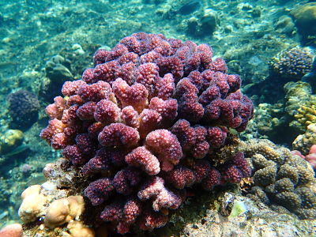
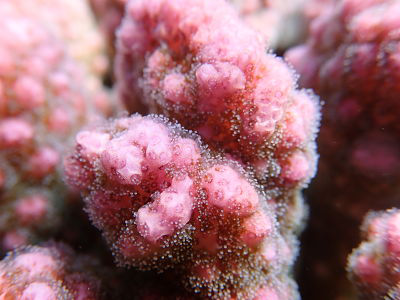

# The genome of the cauliflower coral *Pocillopora verrucosa*

This repository contains all the scripts used for the genome assembly, filtering and annotation of the cauliflower coral *Pocillopora verrucosa*. 
The scripts for the transcriptome assembly and filtering of *Pocillopora verrucosa* are also available in this repository.

 

## Summary
The global persistence of corals is currently threaten by climate change and ocean warming. In this context the genomic resources are invaluable as a foundation to study the adaptive potential and genetic distinctiveness of coral species. The cauliflower coral, *Pocillopora verrucosa*, is a widely spread reef-building coral with important ecological roles in the maintenance of reefs across the Red Sea, the Indian Ocean, and the Pacific Ocean. Here we provide a reference genome for the coral *P. verrucosa* from the Red Sea. The genome has an assembly size of 380,505,698 bp with a scaffold and contig N50 of 333,696 bp and 75,704 bp, respectively. A high percentage of the genome (41.2%) is comprised of repetitive elements. *Pocillopora verrucosa* genome features 27,529 gene models of which 90.27% have RNA-Seq evidence and about 97% have homology to genes in the SwissProt or TrEMBL curated databases.

### Important concepts
Coral holobiont: refers to the complex symbiotic relationship between the cnidarian host and microorganisms, mainly of algal (family Symbiodiniaceae), bactial and viral origin. 

## Workflow

#### Genome
1. Shotgun sequencing reads were preprocessed.
   - Low quality sequences were removed and adapter sequences were trimmed.
   - Reads shorter than 100bp were filtered out.
   - Reads quality was inspected.
   - PCR duplicates were removed.
   - Reads potentially coming from algal, bacterial and/or viral components of the coral holobiont were filtered out. 

2. Genome assembly and filtering.
   - Genome was assembled using the preprocessed reads.
   - The raw assembly was filtered as follows:
     - Circular contigs were filtered out.
     - Contigs containing mitocondrial and overlooked vectors were filtered out.
     - Contigs from potential contamination sources (algal, bacteria and/or viruses) were filtered out.
   - The preliminary filtered genome assembly was reference scaffolded and gaps were filled when possible.
     - Oversplitted loci were identified and the haploid assembly was rebuild.
   - The completeness of the filtered haploid genome was evaluated. 
   
3. Identification and annotation of repetitive elements in the genome.
   - Repetitive elements were identified by building a frequency table of all repeats of size 16.
   - Repeat motifs shorter than 50 nucleotides and occuring less than 10 times across the genome were filtered out.
   - Repeat motifs were annotated using the RepbaseV24.02 database and a custom made database of transposable elements.

4. Gene models prediction and annotation (note that transcriptome information is necessary at this point).
   - Spliced alignments of expressed transcript sequences were used to annotate the genome.
   - The best trasncripts were selected by filtering out those that were a) ambiguous, b) incomplete, c) have less than 3 exons, d) redundant and e) have repetitive elements.
   - Gene models were predicted using the set of transcripts described in the previous step.
   - The completeness of the set of predicted gene models was evaluated.
   - The complete set of predicted proteins (including transcript spliced forms .t2) was hierarchically annotated using  SwissProt, TrEMBL and nr databases.  
   
#### Transcriptome
1. RNAseq sequencing reads were preprocessed.
   - Low quality sequences were removed and adapter sequences were trimmed.
   - Reads quality was inspected.
   - PCR duplicates were removed.
   - Sequencing errors in the remaining reads were corrected.
   - Reads shorter than 100bp were filtered out.

2. Trancriptome assembly and filtering.
   - The transcriptome of *P. verrucosa* holobiont was assembled.
   - The longest isoform per transcript was selected and aligned to custom made databases of nucleotide sequences of cnidarians, Symbiodiniaceae, bacteria and viruses. The best hit was used as criteria to determine the origin of the transcript.
   - The completeness of the transcriptome was evaluated.

## Genomic tools

|           Tool | Version (used) | Note                                |
|---------------:|----------------|-------------------------------------|
|    Trimmomatic | 0.36           |                                     |
|         FastQC | 0.11.8         |                                     |
|       Cutadapt | 2.3            |                                     |
| clumpify.sh    | 38.51          | part of the bbmap toolset (v.38.51) |
| bbsplit.sh     | 38.51          | part of the bbmap toolset (v.38.51) |
| DiscovarDeNovo | LATEST VERSION | dowloaded on Jun 19, 2019           |
| Blast+         | 2.9.0+         |                                     |
| CSAR           |                | https://github.com/ablab-nthu/CSAR  |
| GapFiller      | 1.11           |                                     |
| Haplomerger2   | 20180514       |                                     |
| Quast          | 5.0.2          |                                     |
| RepeatMasker   | 4.0.7          |                                     |
| RepeatScout    | 1.0.5          |                                     |
| PrinSeq-lite   | 0.20.4         |                                     |
| SPAdes         | 3.10.1         |                                     |
| Trinity        | 2.6.5          |                                     |
| PASA           | 2.3.3          |                                     |
| Augustus       | 2.5.5          |                                     |
| pblat          | 36x2           | multithread blat algorithm          |
| jellyfish      | 2.2.6          |                                     |
| BUSCO          | 3              |                                     |
